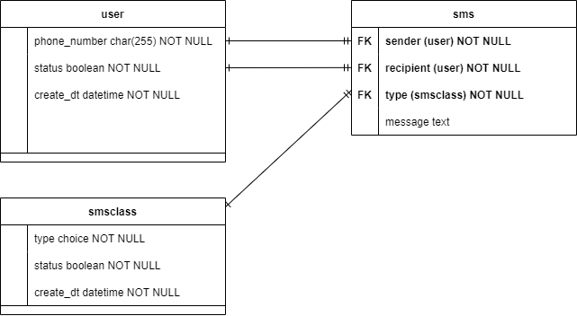

# SMS Classifier

[](https://travis-ci.org/joemccann/dillinger)

## Kelompok 4(?) NLP

- 23521023 Dimmas Mulya
- 23521077 Muhammad Faris Muzakki
- 23521085 Aaz M Hafidz Azis

## Features

- Lorem Ipsum
- Lorem Ipsum
- Lorem Ipsum

## Tech

This project using several techstack:

- [Postgresql] - Database management system
- [Django] - Fullstack framework
- [Pandas] - xxxx.
- [Keras] - xxxx
- [node.js] - evented I/O for the backend
- [jQuery] - xxxx

## Installation

Create python virtual environment

Install the dependencies.

```sh
pip install -r requirements.txt
npm install
```

Create the config.py file in core directory (customize the contents with yours)

```sh
DB_NAME = 'sms_classifier'
DB_USER = 'admin'
DB_PASSWORD = 'admin'
DB_HOST = 'localhost'

STATIC_URL = '/static/'
MEDIA_URL = '/media/'
FORCE_SCRIPT_NAME = ''
DEBUG = True
```

## Migrations

make migrations files
```sh
python manage.py makemigrations
```

execute the migrations files 
```sh
python manage.py migrate
```
## Development

running the server

```sh
python manage.py runserver
```
<!--  -->
## Database Design
